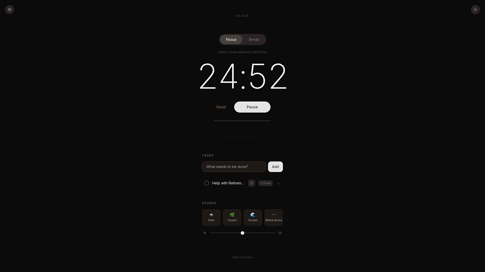

"# 🎯 getinflow

> **Reach your flow state faster**  
> A minimalist Pomodoro timer, task manager, and ambient soundscape app designed to eliminate distractions and accelerate deep work.



---

## ✨ Why getinflow?

In a world full of distractions, **getinflow** combines three evidence-based productivity techniques into one seamless experience:

1. **⏱️ The Pomodoro Technique** — Work in focused 25-minute intervals with built-in breaks
2. **📋 Intentional Task Selection** — Choose what matters most before starting your session
3. **🎧 Immersive Ambient Audio** — Block out noise with natural soundscapes

By linking your Pomodoro sessions directly to specific tasks, you gain complete visibility into where your focus time actually goes — no guesswork, just data.

---

## 🚀 Key Features

### Timer & Focus Sessions
- **Pomodoro Timer** with Focus (25 min) and Break (5 min) modes
- **Session Tracking** — Every completed or paused session is logged with timestamps and duration
- **Visual Progress** — Clean progress bar and animated task indicators

### Task Management
- **Add, Complete, and Delete Tasks** with a minimalist interface
- **Time Tracking** — Automatically logs how much focus time you've spent on each task
- **Inline Editing** — Edit task titles directly without recreating them
- **Persistent Storage** — All tasks and completion states survive page reloads via localStorage

### Ambient Soundscapes
- **Four Curated Sounds**: Rain 🌧, Forest 🌿, Ocean 🌊, White Noise 〰
- **Volume Control** with smooth slider
- **Seamless Looping** — Sounds play continuously without interruption

### Data Export & Import
- **Export to JSON** — Download a complete backup including:
  - All tasks with time spent, creation dates, and completion status
  - Full session history (focus and break sessions)
  - Summary statistics (total focus time, completed tasks, session count)
- **Import from JSON** — Restore your data from a previous export
- **Schema Documentation** — Built-in reference for the export format

### Dark Mode
- **Toggle between Light and Dark themes** with smooth transitions
- **Automatic Persistence** — Your theme preference is remembered

---

## 🛠️ Tech Stack

| Technology | Purpose |
|------------|---------|
| **Next.js 14** | React framework with App Router |
| **React 18** | UI component library |
| **Tailwind CSS** | Utility-first styling |
| **localStorage** | Client-side data persistence |
| **Web Audio API** | Notification bell synthesis |
| **HTML5 Audio** | Ambient soundscape playback |

### Key Dependencies
- **Radix UI** — Accessible component primitives
- **Lucide React** — Icon library
- **Framer Motion** — Animation library
- **date-fns** — Date formatting utilities

---

## 📦 Local Setup

### Prerequisites
- **Node.js** 18.x or higher
- **npm** or **yarn** package manager

### Installation

1. **Clone the repository**
   ```bash
   git clone <repository-url>
   cd getinflow
   ```

2. **Install dependencies**
   ```bash
   npm install
   # or
   yarn install
   ```

3. **Run the development server**
   ```bash
   npm run dev
   # or
   yarn dev
   ```

4. **Open in your browser**
   ```
   Navigate to http://localhost:3000
   ```

### Build for Production

```bash
# Create an optimized production build
npm run build

# Start the production server
npm start
```

---

## 📖 How to Use

### Starting a Focus Session

1. **Add a task** — Type what you need to work on and press Enter
2. **Select the task** — Click the \"⏱ Focus\" button next to your task
3. **Start the timer** — Click \"Start\" on the Pomodoro timer
4. **Work until the bell rings** — The timer will notify you when your session ends

### Tracking Your Progress

- **Time badges** appear below each task showing total focus time (e.g., \"⏱ 1h 25m focused\")
- **Session history** is preserved and included in your export data
- Open the **Settings modal** (gear icon) to view summary statistics

### Managing Tasks

- **Complete a task** — Click the circular checkbox
- **Edit a task** — Click the edit icon (pencil) next to the task, modify the text, and press Enter to save
- **Delete a task** — Hover over a task and click the × button
- **Clear active selection** — Click the × in the active task pill above the timer

### Using Ambient Sounds

- Click any sound button (Rain, Forest, Ocean, White Noise) to start playback
- Adjust the volume slider to your preference
- Click the active sound again to stop it

### Exporting Your Data

1. Click the **gear icon** (top-left corner)
2. In the modal, click **Export JSON**
3. A file named `focus-export-YYYY-MM-DD.json` will download

**Export includes:**
- Task names, creation dates, time spent, and completion status
- Full session log with timestamps and durations
- Summary stats (total focus time, completed tasks, session count)

### Importing Data

1. Open the **Settings modal** (gear icon)
2. Click **Choose JSON File** under the Import section
3. Select a previously exported JSON file
4. Confirm the import — ⚠️ **this will replace your current data**

---

## 📊 Export Data Schema

Each export contains structured JSON data:

```json
// {
//   \"version\": \"1.0\",
//   \"exportedAt\": \"2025-06-02T14:30:00.000Z\",
//   \"summary\": {
//     \"totalTasks\": 5,
//     \"completedTasks\": 3,
//     \"totalFocusSeconds\": 4500,
//     \"totalFocusFormatted\": \"1h 15m\",
//     \"totalSessions\": 3
//   },
//   \"todos\": [
//     {
//       \"id\": \"1234567890\",
//       \"taskName\": \"Write project documentation\",
//       \"createdAt\": \"2025-06-01T10:00:00.000Z\",
//       \"dateCreated\": \"Jun 1, 2025\",
//       \"completionStatus\": \"Done\",
//       \"doneAt\": \"2025-06-01T12:30:00.000Z\",
//       \"timeSpentSeconds\": 1500,
//       \"timeSpentFormatted\": \"25m\"
//     }
//   ],
//   \"sessions\": [
//     {
//       \"id\": \"1234567891\",
//       \"mode\": \"focus\",
//       \"startedAt\": \"2025-06-01T10:00:00.000Z\",
//       \"dateStarted\": \"Jun 1, 2025\",
//       \"durationSeconds\": 1500,
//       \"durationFormatted\": \"25m\",
//       \"completed\": true,
//       \"linkedTaskId\": \"1234567890\",
//       \"linkedTaskName\": \"Write project documentation\"
//     }
//   ]
// }
```

---

## 🎨 Design Philosophy

**getinflow** embraces minimalism to reduce cognitive load:

- **No unnecessary features** — Only what you need to focus
- **Clean typography** — Uses Inter font family with refined weights
- **Subtle animations** — Smooth transitions without distraction
- **Accessible color palette** — High contrast in both light and dark modes
- **Single-column layout** — Natural top-to-bottom reading flow

---

## 🗂️ Project Structure

```
/app/
├── app/
│   ├── api/[[...path]]/route.js  # Backend API routes (if needed)
│   ├── page.js                   # Main application component
│   ├── layout.js                 # Root layout with metadata
│   ├── globals.css               # Global styles and Tailwind config
│   └── providers.js              # React context providers
├── components/                   # Reusable UI components
├── lib/                          # Utility functions and helpers
├── public/
│   └── audio/                    # Ambient sound files (.mp3)
├── package.json                  # Dependencies and scripts
├── tailwind.config.js            # Tailwind CSS configuration
└── README.md                     # This file
```

---

## 🤝 Contributing

This is a personal productivity tool, but suggestions and improvements are welcome!

If you'd like to contribute:
1. Fork the repository
2. Create a feature branch (`git checkout -b feature/your-feature`)
3. Commit your changes with clear messages
4. Open a pull request with a detailed description

---

## 📄 License

This project is open source and available for personal and educational use.

---

## 💡 Tips for Maximum Productivity

1. **Plan your tasks the night before** — Start each day with clarity
2. **Use the Pomodoro breaks** — Step away from your desk, stretch, hydrate
3. **Review your export data weekly** — Identify patterns in your focus time
4. **Limit your daily task list** — Quality over quantity (3-5 meaningful tasks)
5. **Pair with ambient sounds** — Find the soundscape that works best for your brain

---

**Built with focus. Designed for flow.** 🎯
"
